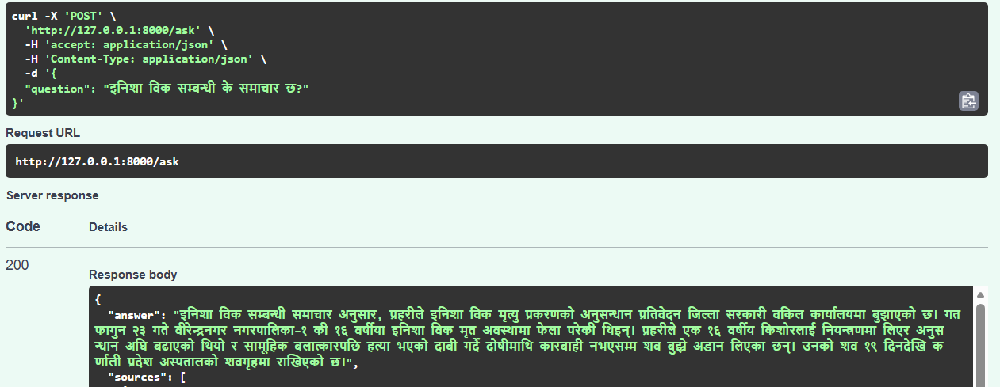

# 🇳🇵 Nepali News RAG (Retrieval-Augmented Generation)

A **Nepali-language knowledge assistant** that uses a full **RAG pipeline**:

- Scrapes Nepali news
- Cleans and chunks data
- Generates embeddings
- Stores vectors in FAISS
- Retrieves relevant context
- Uses **Ollama (Gemma)** to generate answers

---

## 🚀 Features

- 🔍 Semantic search over Nepali news  
- 🧠 Multilingual embeddings (`paraphrase-multilingual-mpnet-base-v2`)  
- ⚡ FastAPI backend (`/ask` endpoint)  
- 📦 FAISS vector database for fast retrieval  
- 🤖 Local LLM inference via **Ollama (gemma3:4b)**  
- 🇳🇵 Designed specifically for Nepali language  

---

## 🏗️ Project Structure
nepali-news-rag/
├── backend/
│ ├── main.py # FastAPI RAG API
│ ├── scraper.py # Scrape Nepali news
│ ├── cleaning.py # Clean raw data
│ ├── embeddings.py # Generate embeddings
│ ├── build_index.py # Build FAISS index
│
├── data/
│ ├── clean_output.json
│ ├── chunked_data.json
│ ├── chunk_map.json
│ ├── faiss.index
│
├── output.json # scraped raw output
└── README.md

---

## ⚙️ Pipeline Overview

### 1️⃣ Scraping
python backend/scraper.py
Collects Nepali news articles
Saves to output.json

### 2️⃣ Cleaning
python backend/cleaning.py
Cleans text
Removes noise
Outputs: clean_output.json

### 3️⃣ Chunking + Embeddings
python backend/embeddings.py
Splits data into chunks
Generates embeddings using Sentence Transformers
Outputs:
chunked_data.json
chunk_map.json

### 4️⃣ Build FAISS Index
python backend/build_index.py
Converts embeddings into FAISS index
Outputs:
faiss.index

### 5️⃣ Run API Server
uvicorn backend.main:app --reload --port 8000
Endpoint
POST /ask

### Example Request

### 🔁 How RAG Works in This Project
User sends a question
Question is embedded using SentenceTransformer
FAISS retrieves top K similar chunks
Context is built from retrieved chunks
Sent to Ollama (Gemma model)
Model generates final answer

### Installation
git clone https://github.com/YOUR_USERNAME/nepali-news-rag.git
cd nepali-news-rag

python -m venv venv
source venv/bin/activate   # Linux/macOS
venv\Scripts\activate      # Windows

``uv sync``
#Make sure to run gemma3:4b